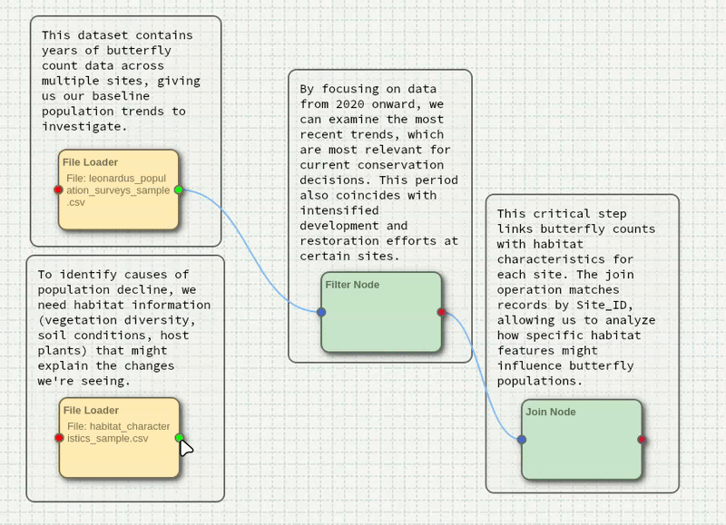

# DANCR - Data Analysis Node Canvas for Research

DANCR is a visual programming tool for data analysis, processing, and visualization that allows users to build data pipelines through a drag-and-drop interface.

## Example Tutorial

Click to expand: Investigating Butterfly Population Decline with DANCR

# Investigating Butterfly Population Decline with DANCR: A Step-by-Step Guide

## If you wish to skip this tutorial and want to just run the finished pipeline:
- Download the DANCR.exe and "dancr butterfly investigation.zip"
- Install and Open DANCR
- Click the floating action button (FAB) in the bottom right corner of the canvas and navigate to "File Operations"
- Select "Import Package Pipeline (.zip)" and select "dancr butterfly investigation.zip"
- Execute pipeline by right clicking the canvas and selecting "Execute Pipeline" or via the FAB

<!-- 
SCREENSHOT SUGGESTION:
Add a screenshot of the DANCR interface with the imported pipeline.
Caption: DANCR with the pre-packaged butterfly investigation pipeline loaded
-->

## The Mystery: What's Happening to the Leonardus Skipper Butterflies?

Recent surveys suggest Leonardus Skipper butterfly populations are declining across monitoring sites. Your task is to investigate:
- How severe is the population decline?
- Which sites are most affected?
- What environmental factors correlate with population changes?
- Are conservation efforts showing any impact?

Let's use DANCR to find answers in the data.

## Step 1: Starting Your Investigation

1. Launch DANCR after installing the DANCR.exe
2. You'll see a blank canvas workspace - this will be your investigation board
3. Download the following files:
- "leonardus_population_surveys_sample.csv"
- "habitat_characteristics_sample.csv"
- "human_impacts_sample.csv"

## Step 2: Gathering the Evidence (Loading Data)

1. Right-click on the canvas and select "File Loader Node" 
2. Double-click on the new node
3. Navigate to and select "leonardus_population_surveys_sample.csv"
4. When the column selection dialog appears, leave all columns checked
5. Click "OK"

**Why this step matters:** This dataset contains years of butterfly count data across multiple sites, giving us our baseline population trends to investigate.

6. Create a second File Loader Node
7. Load "habitat_characteristics_sample.csv"
8. Keep all columns

**Why this step matters:** To identify causes of population decline, we need habitat information (vegetation diversity, soil conditions, host plants) that might explain the changes we're seeing.

<!-- 
SCREENSHOT SUGGESTION:
Add a screenshot showing the canvas with the two File Loader nodes.
Caption: Initial data loading setup with population and habitat data nodes
-->

## Step 3: Focusing on Recent Trends

1. Right-click and add a "Filter Node"
2. Connect the green output port of the population surveys node to the blue input port of the Filter Node
3. Double-click on the Filter Node
4. Create a filter:
   - Select "Year" column
   - Choose ">=" operator
   - Enter "2020" as the value
5. Click "Ok"

**Why this step matters:** By focusing on data from 2020 onward, we can examine the most recent trends, which are most relevant for current conservation decisions. This period also coincides with intensified development and restoration efforts at certain sites.

## Step 4: Connecting Population and Habitat Data

1. Right-click and add a "Join Node"
2. Connect the red output port of the Filter Node to the blue input port of the Join Node
3. Connect the green output port of the habitat data node to the blue input port of the Join Node
4. Double-click on the Join Node
5. When prompted, select "Full Outer Join"

**Why this step matters:** This critical step links butterfly counts with habitat characteristics for each site. The join operation matches records by Site_ID, allowing us to analyze how specific habitat features might influence butterfly populations.

## Step 5: Connecting Population and Habitat Data

1. Add a File Loader node and load "human_impacts_sample.csv"
2. Keep all columns
3. Right-click and add a "Join Node"
4. Connect the green output port of the Human Impacts Node to the blue input port of the Join Node
5. Connect the red output port of the previous join node that joined the population surveys with the habitat characteristics to the blue input port of the join node connecting with the human impacts node
6. Double-click on the Join Node
7. When prompted, select "Full Outer Join"

**Why this step matters:** This step links the the data we have on population counts, the habitat, and potential human impacts, so we can nail down the cause of why there are declining populations and what we can do to stop it

<!-- 
SCREENSHOT SUGGESTION:
Add a screenshot of the workflow with all data sources connected through join nodes.
Caption: Complete data integration workflow connecting all three datasets
-->

## Step 6: Calculating Key Indicators

1. Right-click and add a "Calculation Node"
2. Connect the red output port of the second Join Node to the blue input port of the Calculation Node
3. Double-click on the Calculation Node
4. Click "Create New Formula"
5. Set up your first calculation:
   - Formula Name: "Population_Density"
   - Formula: "`Count`/`Host_Plant_Abundance`"
6. Create a second calculation:
   - Formula Name: "Site_Health_Index"
   - Formula: "(`Count` / `Host_Plant_Abundance`) * (100 - `Pesticide_Concentration`)"
7. Check "Retain non-calculated columns"
8. Click "OK"

**Why this step matters:** Raw counts don't tell the whole story. Population_Density shows butterflies per host plant - a critical metric that accounts for habitat carrying capacity. The Site_Health_Index integrates both host plant availability and pesticide impact, creating a composite measure of habitat quality.

## Step 7: Visualizing Population Decline

1. Right-click and add a "Plot Node"
2. Connect the red output port of the Calculation Node to the blue input port
3. Double-click on the Plot Node
4. Configure the plot:
   - Plot Type: Time Series
   - X-axis: "Time"
   - Y-axis: "Count"
   - Title: "Butterfly Population Trends (2020-2023)"
5. Click "Ok"
6. Choose "Survey_Date" for the Date Column
7. Add the "Count" column for the y-axis column
8. Click "Ok"

It shows the population actually increasing? This is strange? Let's adjust the filter data to show data from 2018-2023.

Now we can see that there was a strong population count previous to 2020 but had a sharp decline between 2020 and 2021.

<!-- 
SCREENSHOT SUGGESTION:
Add a screenshot of the time series visualization showing the population decline.
Caption: Time series plot revealing the butterfly population decline between 2018-2023
-->

**Why this step matters:** Initial examination of the 2020-2023 butterfly population data appeared to contradict reports of decline, instead showing an increasing trend that didn't align with concerns. However, after expanding our analysis to include earlier data from 2018-2019, we confirmed that a significant population decline had indeed occurred prior to 2020, with the recent upward trajectory from 2021-2023 potentially representing recovery that coincides with the implementation of conservation efforts.

## Step 8: Uncovering Environmental Correlations

1. Add another Plot Node
2. Connect it to the Calculation Node
3. Configure:
   - Plot Type: Scatter
   - X-axis: "Pesticide Concentration"
   - Y-axis: "Population Density"
   - Title: "Impact of Pesticides on Population Density"
4. Click "Ok"
5. Choose "Pesticide_Concentration" for the x axis
6. Choose "Population_Density" for the y axis
7. Color by ""Protected_Status"
8. Click "Show Best Fit Line"
9. Click "Ok"

**Why this step matters:** This plot reveals a key finding in our investigation - a clear negative correlation between pesticide levels and butterfly population density. Protected sites (shown in a different color) maintain higher population densities even with some pesticide presence, suggesting protective measures help buffer against chemical impacts.

## Step 9: Uncovering Environmental Correlations

1. Add another Plot Node
2. Connect it to the Calculation Node
3. Configure:
   - Plot Type: Bar
   - X-axis: "Site"
   - Y-axis: "Health Index"
   - Title: "Site Health Index by Location"
4. Click "Ok"
5. Choose "Site_ID" for the x axis
6. Add "Site_Health_Index" for the y axis
7. Click "Ok"

This is a lot all at once for a single chart.

8. Click to select the connection between the calculation node and the bar plot node and press delete when highlighted
9. Add a Filter node and connect the calculation node to the new filter node
   - Filter by "Habitat_Type"
   - Set operator to "="
   - Select "Prairie"
10. Select the filter node and copy and paste via "Ctrl+C" and "Ctrl+V" or via the right click dialog menu.
11. Select "Forest Edge" as the habitat type. Repeat for the remaining two filters and habitat types.
12. Copy the bar plot node and paste three more times (for each habitat filter)
13. Adjust the bar plot node titles according to their habitat filters

<!-- 
SCREENSHOT SUGGESTION:
Add a screenshot showing the multiple bar charts by habitat type.
Caption: Separate bar charts showing Site Health Index for different habitat types
-->

**Why this step matters:** We now have Bar plots for each habitat type making clear the Site Health Index by Habitat Types so we can determine which sites are most affected by population decline. We can clearly see that the Forest Edge habitat has the worst Site Health Index overall, and the population was nearly wiped out. The Wetland Edge has fantastic site health, however a couple of sites are noticeably in bad shape compared to others. The same is true for the Prairie and Meadow habitats. We can investigate further by creating and adjusting filters based on protected sites vs non protected sites, before, during, and after pesticide concentration increases, etc. I challenge you to put a cap on this mystery by investigating further using the skills learned in this tutorial

## Step 10: Saving Your Investigation Workflow

1. Click the floating action button (FAB) in the bottom right corner and navigate to "File Operations" to save your pipeline as a .json or as a .zip file if you wish to export the entire pipeline (files and all) to another computer or to share with somebody else.
2. You can load previously saved files by going to "File Operations" and selecting "Load Pipeline (.json)" or "Import Package Pipeline (.zip)"

<!-- 
SCREENSHOT SUGGESTION:
Add a screenshot of the complete workflow with all nodes connected.
Caption: Complete DANCR workflow for the butterfly population investigation
-->

## Key Features

- **Visual Programming**: Design data workflows by connecting nodes on a canvas
- **Data Processing**: Load, filter, transform, and analyze data without writing code
- **Visualization**: Create plots, charts, and data summaries
- **Pipeline Management**: Save, load, and share complete analysis pipelines
- **Collaborative Features**: Add annotations and share workflows with colleagues

## Node Types

### Data Ingestion
- **File Loader**: Import data from CSV and Excel files
- **Project Overview**: Manage project data and metadata

### Transformation
- **Filter Node**: Apply conditions to subset data
- **Sort Node**: Arrange data based on specified columns
- **Join Node**: Combine datasets from multiple sources
- **Calculation Node**: Perform custom mathematical operations
- **Column Selector Node**: Choose specific columns for analysis
- **Outlier Removal Node**: Identify and filter statistical outliers

### Visualization
- **Plot Node**: Create various chart types (scatter, line, bar)
- **Data Viewer Node**: Examine tabular data interactively
- **K-Means Cluster Node**: Perform and visualize cluster analysis
- **Data Summary Node**: Generate statistical summaries

### Export
- **Export Node**: Save processed data to files

## Interface Features

- Multi-tabbed interface for managing multiple workflows
- Dark/light mode support
- Undo/redo functionality
- Copy/paste nodes and connections
- Text annotations
- Mood board for visual references

## Getting Started

1. Add nodes to the canvas from the node library
2. Connect nodes by dragging from output to input ports
3. Configure nodes by double-clicking them
4. Execute the pipeline to process your data
5. Save your workflow for future use

## System Requirements

- Supports Windows

